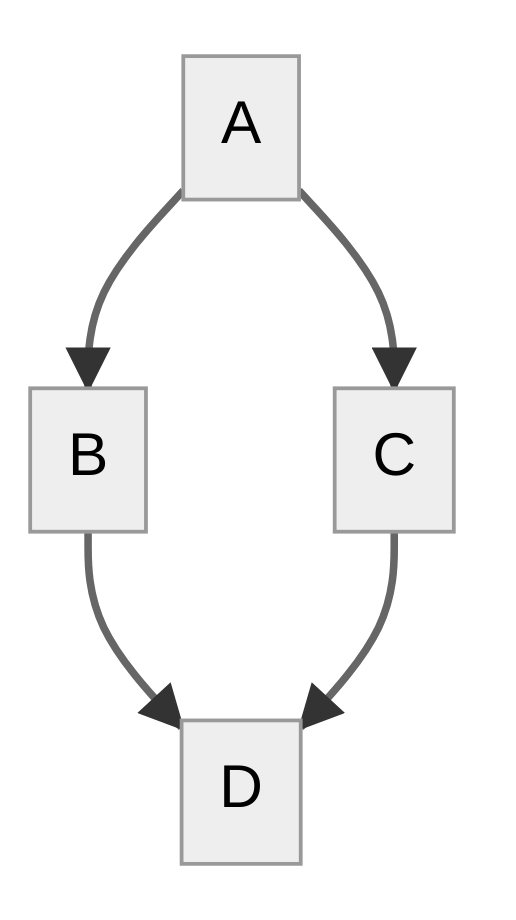

# Mermaid-Markdown-Render-Test

A GitHub Action and Utility for rendering Mermaid-JS diagrams in Markdown files for display on GitHub.

Documentation is good. Diagrams are good. But with all good things, if they are hard to do, we do less of them. [Mermaid](https://mermaid-js.github.io/mermaid/#/) makes it very easy to create diagrams and this tool makes using Mermaid diagrams in Markdown documents a breeze. It is inspired by [Typora's Mermaid support](https://support.typora.io/Draw-Diagrams-With-Markdown/) and uses a simple trick that hides the diagram source and displays a rendered diagram image instead, when reading the document on GitHub. Keeping diagrams up-to-date is easy because the diagram source is in the Markdown file. No need to go off to the live-editor and copy things back and forth.

## Mermaid in Markdown

`render-md-mermaid` will pick up any Mermaid graph in Markdown files that is defined as:

~~~markdown

  
diagram source

  This details block is collapsed by default when viewed in GitHub. This hides the mermaid graph definition, while the rendered image
  linked above is shown. The details tag has to follow the image tag. (newlines allowed)

~~~

The script will pick up the graph definition from the mermaid code block and render it to the image file and path specified in the
image tag using [mermaid-cli](https://github.com/mermaid-js/mermaid-cli). The rendered image can be in svg or png format, whatever is specified will be generated. The result is displayed like this:

  
diagram source

  This details block is collapsed by default when viewed in GitHub.
  This hides the mermaid graph definition, while the rendered image
  linked above is shown.
  The details tag has to follow the image tag. (newlines allowed)

When using the GitHub Action, this will automatically happen for every Markdown file in the repository.
